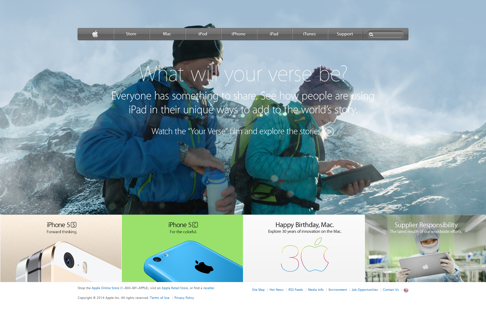

# apple-home-page-clone
This project is a clone of Apple homepage from Web Archive.

> Project built using basic HTML and CSS.

This static page contains:
- Navbar built with CSS linear-gradient and CSS Sprite
- Main hero section with background image
- Promo section 
- Footer

# What it does
It shows you a static clone of [this page](https://web.archive.org/web/20140301004610/http://www.apple.com/).

## Built With
- HTML 5
- CSS 3
#### and deployed to Raw Githack

## Live Demo
[Live Demo](https://rawcdn.githack.com/tirthajyoti-ghosh/apple-home-page-clone/32292b8b9bf9a710676f1948445c2cf40d016791/index.html)

## 🤝 Contributing

Contributions, issues and feature requests are welcome! Start by:
* Forking the project
* Cloning the project to your local machine
* `cd` into the project directory
* Run `git checkout -b your-branch-name`
* Make your contributions
* Push your branch up to your forked repository
* Open a Pull Request with a detailed description to the development branch of the original project for a review

## Attributions and Credit
Special thanks to [Web Archive](https://web.archive.org/)

## Authors

👤 **Tirthajyoti Ghosh**

- Github: [@tirthajyoti-ghosh](https://github.com/tirthajyoti-ghosh)
- Twitter: [@TirthajyotiGho1](https://twitter.com/TirthajyotiGho1)
- Linkedin: [tirthajyoti-ghosh](https://www.linkedin.com/in/tirthajyoti-ghosh-370544199/)

## Show your support

Give a ⭐️ if you like this project!

## 📝 License

Free

### Enjoy!
